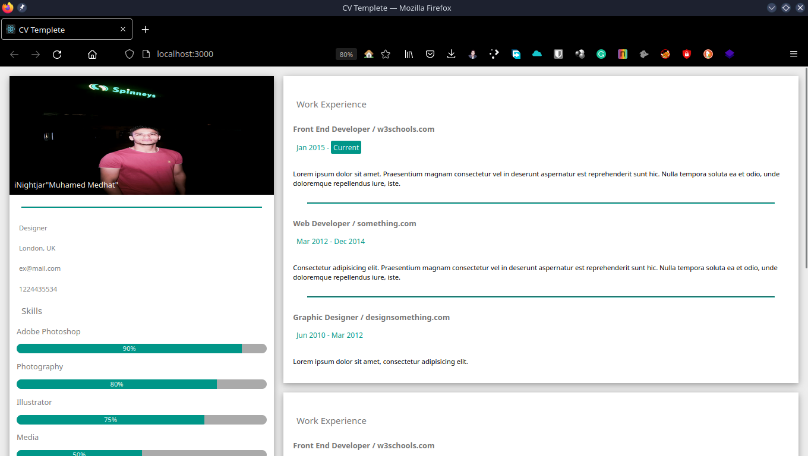
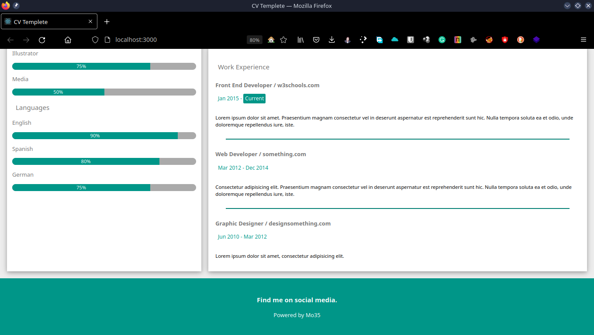

#  Simple CV Templete

<!-- ## Screen Shot

<!-- 

 --> -->
## `You need to add bootstrap dependency`
    
``` 
$npm install bootstrap
```

``` 
$npm start
```

Runs the app in the development mode.
Open [http://localhost:3000](http://localhost:3000) to view it in your browser.